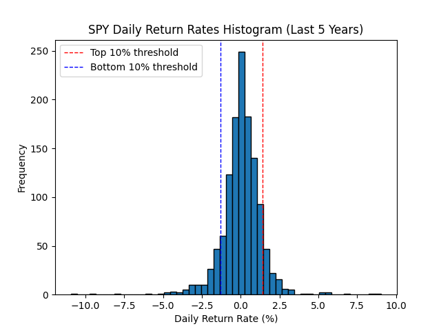

# Real-Time Stock Alert System

A Python service that streams live equity prices via **Finnhub WebSocket**, compares each tick against a **percentile threshold calibrated on 5 years of historical returns**, and delivers an **SMS via Twilio** whenever a move is statistically extreme.



---

## How It Works

```
Yahoo Finance ──► 5y daily closes ──► compute 10th/90th percentile thresholds
                                                  │
Finnhub WS ──────► live price tick ──► today's return vs. previous close
                                                  │
                                        within threshold? ──► SMS via Twilio
```

Historical data is fetched **once at startup**. Thresholds are recomputed per-tick in O(1) via NumPy. WebSocket handlers are closure-based (no global state), and the main loop auto-reconnects with exponential backoff on disconnection.

---

## Stack

| Library | Role |
|---|---|
| `yfinance` | 5-year SPY historical closes from Yahoo Finance |
| `websocket-client` | Finnhub real-time trade stream |
| `twilio` | SMS delivery |
| `pandas` / `numpy` | Return computation and percentile analysis |
| `matplotlib` | Return distribution histogram |
| `python-dotenv` | Credential management via `.env` |

---

## Quickstart

```bash
git clone https://github.com/matthew-ju/Real-Time-Stock-Alert-System.git
cd Real-Time-Stock-Alert-System
pip install -r requirements.txt
cp .env.example .env  # fill in your Twilio + Finnhub credentials
python3 -m spy_alert
```

### Credentials (`.env`)

Open `.env` and set your configuration. **To monitor a different stock, just change `TICKER`:**

```ini
# Alert configuration — the only lines you need to touch day-to-day
TICKER=SPY          # any valid symbol: TSLA, AAPL, QQQ, NVDA, etc.
PERCENTILE=10       # alert fires when daily return is in top/bottom N%
LOOKBACK_YEARS=5    # years of history used to calibrate thresholds

# Twilio credentials — https://console.twilio.com
TWILIO_ACCOUNT_SID=ACxxxxxxxxxxxxxxxxxxxxxxxxxxxxxxxx
TWILIO_AUTH_TOKEN=xxxxxxxxxxxxxxxxxxxxxxxxxxxxxxxx
TWILIO_FROM=+1XXXXXXXXXX
TWILIO_TO=+1XXXXXXXXXX

# Finnhub API key — https://finnhub.io/dashboard
FINNHUB_API_KEY=your_finnhub_api_key_here
```

| Variable | Where to find it |
|---|---|
| `TWILIO_ACCOUNT_SID` | [console.twilio.com](https://console.twilio.com) → Account Info |
| `TWILIO_AUTH_TOKEN` | Same page, click the eye icon |
| `TWILIO_FROM` | Console → Phone Numbers → Active Numbers |
| `TWILIO_TO` | Your mobile number (must be verified on trial accounts) |
| `FINNHUB_API_KEY` | [finnhub.io/dashboard](https://finnhub.io/dashboard) → API Keys |

---

## Usage

```bash
# Defaults: SPY, top/bottom 10%, 5-year lookback
python3 -m spy_alert

# Monitor QQQ, alert on top/bottom 5% moves
python3 -m spy_alert --ticker QQQ --percentile 5 --lookback 3

# Run only during NYSE market hours (Mon–Fri 9:30 AM–4:00 PM ET)
bash execute_stock_SPY_alerts.sh [--ticker QQQ] [--percentile 5]
```

---

## Project Structure

```
├── spy_alert/
│   ├── config.py     # constants and env-var helpers
│   ├── data.py       # yfinance fetch + return computation
│   ├── chart.py      # matplotlib histogram
│   ├── alerts.py     # Twilio SMS + tick evaluation
│   ├── stream.py     # Finnhub WebSocket handler factory
│   ├── cli.py        # argparse + main() orchestration
│   ├── __main__.py   # python -m spy_alert entry point
│   └── __init__.py
├── execute_stock_SPY_alerts.sh   # weekday-hours scheduler
├── requirements.txt
└── .env.example
```

---

## Security

`.env` is gitignored and never committed. For production deployments, replace `.env` with a secrets manager (AWS Secrets Manager, GCP Secret Manager, etc.).

---

## License

MIT
